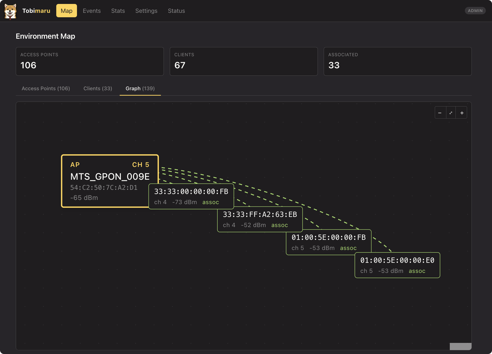

# Tobimaru

[](https://github.com/v0lka/tobimaru/actions/workflows/ci.yml)
[](https://codecov.io/gh/v0lka/tobimaru)
[](./LICENSE)

Tobimaru is a WiFi Intrusion Detection System (WIDS) for Linux and macOS. It operates as a daemon that monitors wireless traffic in monitor mode, detects attacks such as deauthentication floods, and provides monitoring through a REST API, SSE real-time updates, and an embedded React web dashboard — all in a single binary.



## Features

- **Passive WiFi monitoring** — captures management, control, and data frames via monitor mode on Linux (`iw`) and macOS (`airport`)
- **802.11 frame parsing** — extracts MAC addresses, SSIDs, channels, RSSI, reason codes, and information elements
- **Channel hopping** — scans 2.4 GHz (and optionally 5 GHz) bands with weighted dwell time for primary channels (1, 6, 11)
- **Detection engine** — rule-based architecture with deduplication and severity levels (info/warning/critical)
- **Network state tracking** — in-memory maps of observed APs and clients with TTL-based eviction
- **Whitelist/blacklist** — CRUD operations with auto-learning mode for trusted devices
- **Persistent storage** — pure-Go SQLite database for security events, state snapshots, sessions, and whitelist persistence
- **REST API** — authenticated HTTP API for APs, clients, events, config, whitelist/blacklist, status, and statistics
- **SSE streaming** — real-time push of security events and state updates to the dashboard
- **Embedded dashboard** — React 19 + TypeScript SPA with pages for status, network map, events, statistics, and settings
- **Authentication** — session-based auth with bcrypt-hashed passwords, admin/read-only user roles
- **Platform-aware** — adapts to Linux (`iw`) and macOS (`airport`) tooling with runtime capability detection
- **Structured logging** — slog-based output in text or JSON format
- **Graceful shutdown** — SIGINT/SIGTERM handling with LIFO cleanup hooks and 30-second deadline
- **Cross-compilation** — builds for linux/amd64, linux/arm64, darwin/arm64
- **Single binary** — the dashboard SPA is embedded via `go:embed`, no external web server needed

## Requirements

- Go 1.26+
- GNU Make
- Node.js and npm (only for building the web dashboard; pre-built bundle is committed)
- Linux or macOS
- Root/sudo access (required for monitor mode and BPF device access)
- `iw` and `ip` utilities (Linux)
- `airport` utility (macOS) — see [macOS Setup](docs/development/macos-setup.md)

## Quick Start

```bash
# Clone and build
git clone https://github.com/vkochetkov/tobimaru.git
cd tobimaru
make build

# Copy and edit configuration
cp configs/tobimaru.yaml tobimaru.yaml
# Set monitor.interface to your WiFi interface (e.g., wlan0 on Linux, en0 on macOS)

# Run (requires root)
sudo ./bin/tobimaru -config tobimaru.yaml
```

## Building All Components

### Go Backend

```bash
make build       # Build for current platform → bin/tobimaru
make build-all   # Cross-compile for linux/amd64, linux/arm64, darwin/arm64
```

### Web Dashboard

The dashboard is a React 19 + TypeScript SPA located in `web/`. A pre-built bundle is committed to `internal/api/web/dist/` so that `make build` produces a complete single binary. Rebuild the dashboard only when the frontend changes.

> **Important:** `make web` requires Node.js dependencies to be installed first. Run `make web-deps` before `make web`, or use `make web-deps && make web` to do both in one step.

```bash
make web-deps    # Install Node.js dependencies (npm ci) — required before make web
make web         # Build SPA into internal/api/web/dist/
make web-clean   # Remove the embedded SPA bundle (forces rebuild)
make lint-web    # Lint SPA sources with ESLint
```

**Development mode** — run the dashboard with hot reload while the Go backend serves the API:

```bash
# Terminal 1: Run the Go backend with API enabled
sudo ./bin/tobimaru -config tobimaru.yaml

# Terminal 2: Start Vite dev server (proxies /api to the backend)
cd web && npm run dev
```

The Vite dev server runs at `http://localhost:5173` and proxies API requests to `http://127.0.0.1:8080`.

## Configuration

Tobimaru uses a YAML configuration file. See [`configs/tobimaru.yaml`](configs/tobimaru.yaml) for a fully annotated example with all available options.

### Command-Line Flags

| Flag             | Description                                                                        |
| ---------------- | ---------------------------------------------------------------------------------- |
| `-config <path>` | Path to YAML configuration file (default: `configs/tobimaru.yaml`)                 |
| `-version`       | Print version information and exit                                                 |
| `-hash-password` | Prompt for a password interactively (no echo) and print its bcrypt hash, then exit |

The `-hash-password` flag is a built-in utility to generate bcrypt hashes for
the YAML configuration. Passwords are never stored in plaintext — the config
accepts only pre-hashed values in `auth.admin_password_hash` and
`auth.user_password_hash`. The flag prompts for the password interactively
using the terminal, so the password does not appear in the process listing
or shell history. No external tools like `htpasswd` are needed.

### Configuration Sections

#### `log` — Logging

| Field    | Type                             | Default | Description   |
| -------- | -------------------------------- | ------- | ------------- |
| `level`  | `debug`, `info`, `warn`, `error` | `info`  | Log verbosity |
| `format` | `text`, `json`                   | `text`  | Output format |

#### `monitor` — WiFi Interface & Capture

| Field                                             | Type     | Default      | Description                                              |
| ------------------------------------------------- | -------- | ------------ | -------------------------------------------------------- |
| `interface`                                       | string   | —            | **Required.** WiFi interface name (e.g., `wlan0`, `en0`) |
| `capture.snaplen`                                 | int      | `65535`      | Max bytes per frame                                      |
| `capture.buffer_size`                             | int      | `2097152`    | Kernel buffer size in bytes (2 MB)                       |
| `capture.frame_buffer_size`                       | int      | `1024`       | Internal frame channel capacity                          |
| `capture.promiscuous`                             | bool     | `true`       | Enable promiscuous mode                                  |
| `capture.timeout`                                 | duration | `100ms`      | pcap read timeout                                        |
| `channel_hopping.enabled`                         | bool     | `true`       | Enable channel scanning                                  |
| `channel_hopping.dwell`                           | duration | `300ms`      | Base time per channel (use `2s` on macOS)                |
| `channel_hopping.weighted_dwell.enabled`          | bool     | `true`       | Give primary channels more dwell time                    |
| `channel_hopping.weighted_dwell.primary_channels` | []int    | `[1, 6, 11]` | Priority channels                                        |
| `channel_hopping.weighted_dwell.multiplier`       | float    | `2.5`        | Dwell multiplier for primary channels                    |
| `channel_hopping.channels_2ghz`                   | []int    | `[1..13]`    | 2.4 GHz channels to scan                                 |
| `channel_hopping.include_5ghz`                    | bool     | `false`      | Enable 5 GHz band scanning                               |

#### `detection` — Detection Engine

| Field               | Type     | Default | Description                                                                                       |
| ------------------- | -------- | ------- | ------------------------------------------------------------------------------------------------- |
| `enabled`           | bool     | `false` | Master switch (five concrete rules: deauth/disassoc/beacon flood, evil twin, unauthorized device) |
| `dedup_window`      | duration | `30s`   | Suppress duplicate alerts                                                                         |
| `alert_buffer_size` | int      | `256`   | Buffered alert channel capacity                                                                   |

#### `state` — Network State Tracking

| Field            | Type     | Default | Description                               |
| ---------------- | -------- | ------- | ----------------------------------------- |
| `enabled`        | bool     | `true`  | Track observed APs and clients in memory  |
| `ttl`            | duration | `10m`   | Remove entries not seen for this duration |
| `sweep_interval` | duration | `1m`    | Eviction sweep interval                   |

#### `whitelist` — Trusted Devices

| Field                    | Type     | Default | Description                                       |
| ------------------------ | -------- | ------- | ------------------------------------------------- |
| `auto_learning.enabled`  | bool     | `false` | Auto-add observed devices to whitelist at startup |
| `auto_learning.duration` | duration | `15m`   | Learning phase duration                           |

#### `storage` — SQLite Persistence

| Field               | Type     | Default       | Description                                          |
| ------------------- | -------- | ------------- | ---------------------------------------------------- |
| `enabled`           | bool     | `false`       | Enable persistence (required for API auth)           |
| `path`              | string   | `tobimaru.db` | Database file path (created with `0600` permissions) |
| `snapshot_interval` | duration | `5m`          | State snapshot interval                              |
| `max_snapshots`     | int      | `288`         | Max snapshots to retain (~24h at 5m intervals)       |
| `max_events`        | int      | `100000`      | Max security events to retain                        |

#### `api` — REST API & Dashboard

| Field                      | Type     | Default          | Description                                                 |
| -------------------------- | -------- | ---------------- | ----------------------------------------------------------- |
| `enabled`                  | bool     | `false`          | Enable HTTP server with embedded dashboard                  |
| `listen`                   | string   | `127.0.0.1:8080` | Bind address (loopback by default)                          |
| `read_timeout`             | duration | `15s`            | HTTP read timeout                                           |
| `write_timeout`            | duration | `30s`            | HTTP write timeout (SSE overrides this)                     |
| `idle_timeout`             | duration | `60s`            | HTTP idle timeout                                           |
| `shutdown_timeout`         | duration | `5s`             | Graceful shutdown deadline                                  |
| `cors.allowed_origins`     | []string | `[]`             | CORS origins (empty = same-origin only)                     |
| `auth.enabled`             | bool     | `true`           | Enable session-based authentication                         |
| `auth.session_ttl`         | duration | `24h`            | Session lifetime                                            |
| `auth.admin_password_hash` | string   | —                | bcrypt hash (generate with `./bin/tobimaru -hash-password`) |
| `auth.user_password_hash`  | string   | —                | Optional read-only account                                  |

### Running with the API and Dashboard

To enable the REST API and embedded web dashboard:

```bash
# 1. Generate bcrypt password hashes (copy the output into the config file)
./bin/tobimaru -hash-password   # prompts for admin password interactively
./bin/tobimaru -hash-password   # prompts for user password interactively

# 2. Paste the hashes into tobimaru.yaml under auth.admin_password_hash / auth.user_password_hash:
#    api:
#      enabled: true
#      listen: "127.0.0.1:8080"
#      auth:
#        enabled: true
#        admin_password_hash: "<bcrypt hash from step 1>"
#        user_password_hash: "<bcrypt hash from step 1>"
#    storage:
#      enabled: true          # required for session persistence

# 3. Run
sudo ./bin/tobimaru -config tobimaru.yaml
```

Open `http://127.0.0.1:8080` in a browser. The dashboard serves the SPA and the REST API is mounted under `/api/`.

> **Security note:** The API binds to loopback (`127.0.0.1`) by default. For remote access, use a reverse proxy (nginx, Caddy) with TLS — see the [Reverse Proxy Setup Guide](docs/development/reverse-proxy-setup.md) for step-by-step instructions.

### API Endpoints

| Method   | Path                   | Auth  | Description                                             |
| -------- | ---------------------- | ----- | ------------------------------------------------------- |
| `GET`    | `/api/status`          | No    | Uptime, version, current channel, platform capabilities |
| `POST`   | `/api/login`           | No    | Authenticate and receive session cookie                 |
| `POST`   | `/api/logout`          | No    | Revoke session                                          |
| `GET`    | `/api/aps`             | Yes   | List observed access points                             |
| `GET`    | `/api/clients`         | Yes   | List observed clients                                   |
| `GET`    | `/api/events`          | Yes   | List security events with filtering & pagination        |
| `GET`    | `/api/stats`           | Yes   | Aggregated statistics                                   |
| `GET`    | `/api/whitelist`       | Yes   | List whitelist entries                                  |
| `GET`    | `/api/blacklist`       | Yes   | List blacklist entries                                  |
| `GET`    | `/api/config`          | Yes   | Read current configuration                              |
| `GET`    | `/api/stream`          | Yes   | SSE stream for real-time events & state updates         |
| `PUT`    | `/api/config`          | Admin | Update configuration at runtime                         |
| `POST`   | `/api/whitelist`       | Admin | Add whitelist entry                                     |
| `DELETE` | `/api/whitelist/{mac}` | Admin | Remove whitelist entry                                  |
| `POST`   | `/api/blacklist`       | Admin | Add blacklist entry                                     |
| `DELETE` | `/api/blacklist/{mac}` | Admin | Remove blacklist entry                                  |

## Running on macOS

See the detailed [macOS Setup Guide](docs/development/macos-setup.md). Key points:

- Install the `airport` utility symlink
- Set `channel_hopping.dwell` to `2s` or more (macOS channel switching has 1–3s overhead)
- Cannot capture while connected to WiFi on the same adapter
- Frame injection is not supported on built-in adapters
- Run as root for BPF device access

## Build Targets

```bash
make build       # Build for current platform (embeds web/dist)
make build-all   # Cross-compile for all targets
make test        # Run tests with race detector
make test-cover  # Run tests and open coverage report
make lint        # Run golangci-lint
make run         # Build and run
make clean       # Remove build artifacts
make fmt         # Format all Go source
make tidy        # Tidy Go modules
make web-deps    # Install SPA dependencies (prerequisite for make web)
make web         # Build SPA into internal/api/web/dist/
make web-clean   # Remove embedded SPA bundle
make lint-web    # Lint SPA sources
make help        # List all targets
```

## Documentation

- [User Guide](docs/USERGUIDE.md) — installation, configuration, and operation
- [Developer Guide](docs/DEVELOPERGUIDE.md) — architecture, building, testing, and contributing
- [macOS Setup](docs/development/macos-setup.md) — detailed macOS configuration
- [Roadmap](docs/development/wifi-watchdog-roadmap.md) — development phases and milestones

## Project Status

Phases 0–5 of the mandatory portion are complete:

| Phase | Status      | Description                                                                                   |
| ----- | ----------- | --------------------------------------------------------------------------------------------- |
| 0     | ✅ Complete | Foundation (config, logging, shutdown, version, CI)                                           |
| 1     | ✅ Complete | Capture Engine (monitor mode, pcap, channel hopping, parsing)                                 |
| 2     | ✅ Complete | Detection Engine (five rules with unit + pcap integration tests)                              |
| 3     | ✅ Complete | Network State & Storage (AP/client tracking, whitelist, SQLite)                               |
| 4     | ✅ Complete | REST API & Dashboard (chi router, SSE, React 19 SPA, auth)                                    |
| 5     | ✅ Complete | Cross-platform (macOS support via CoreWLAN + BPF, Linux native, runtime capability detection) |
| 6–12  | 📋 Planned  | EAPOL analysis, active countermeasures, internal monitoring, analytics, OpenWrt               |

See [`docs/development/wifi-watchdog-roadmap.md`](docs/development/wifi-watchdog-roadmap.md) for the full roadmap.

## License

MIT License. See [LICENSE](LICENSE) for details.
